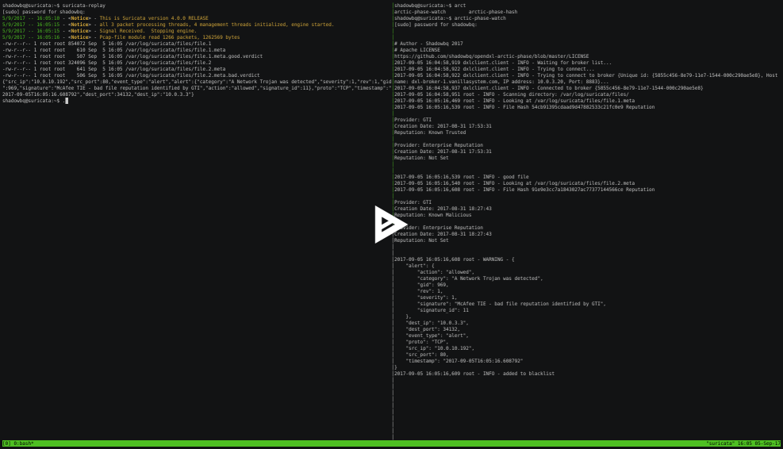

# OpenDXL ArticPhase

## OpenDXL Suricata TIE ATD integration client

This is a set of binaries, configurations and apiclients to integrate Suricata file carving with OpenDXL and McAfee Threat Intelligence Exhange (TIE).

## Usage

[](https://asciinema.org/a/cby9v8v0qr8XeqlKvf6fqG0VP?autoplay=1)

### Hash Lookup

```
./bin/arctic-phase-hash.py --help
Loading configuration from: /home/shadowbq/sandbox/foo/opendxl-arctic-phase/src/../test/etc/dxlclient.config
usage: arctic-phase-hash.py [-h] [-x DXLCLIENT] -a HASH [--version] [-v | -q]

OpenDXL Arctic Phase - Hash integrations

optional arguments:
  -h, --help       show this help message and exit
  --version        show program's version number and exit
  -v, --verbosity  increase output (v)erbosity
                   		(default: None)
  -q, --quiet      (q)uiet all output
                   		(default: False)

OpenDXL parameters:
  -x DXLCLIENT     d(x)lclient.config file location
                   		(default: /etc/dxlclient.config)

Hash parameters:
  -a HASH          h(a)sh md5|sha1|sha256 to test lookup
                   		(default: None)
```

```
opendxl-arctic-phase$ ./bin/arctic-phase-hash.py -x /opt/opendxl/dxlclient.config -f C2FBCC87C157F4F70515A69199E50F82
File Hash C2FBCC87C157F4F70515A69199E50F82 Reputation

Provider: GTI
Creation Date: 2017-08-09 08:08:55
Reputation: Not Set

Provider: Enterprise Reputation
Creation Date: 2017-08-09 08:08:55
Reputation: Not Set

opendxl-arctic-phase$ ./bin/arctic-phase-hash.py -x /opt/opendxl/dxlclient.config -f 91E9E3CC7A1843027AC77377144566CE
File Hash 91E9E3CC7A1843027AC77377144566CE Reputation

Provider: GTI
Creation Date: 2017-08-01 17:23:17
Reputation: Known Malicious

Provider: Enterprise Reputation
Creation Date: 2017-08-01 17:23:17
Reputation: Not Set

Provider: ATD
Creation Date: 2017-08-01 17:23:17
Reputation: Known Malicious
```

### OpenDXL

DXL configuration:

The ArcticPhase client contains a configuration file (dxlclient.config) located in the `/etc` sub-directory that must be populated in order for the Hashes to be able to be looked up on the DXL fabric.

Note: The current configuration we used was `dxlclient >= 3.1.0.586`

See: https://opendxl.github.io/opendxl-tie-client-python/pydoc/sampleconfig.html

#### TIE

Prerequisites:

* The samples configuration step has been completed (see Samples Configuration)
* A McAfee Threat Intelligence Exchange (TIE) Service is available on the DXL fabric

### File Carving using Suricata

Suricata has the capability of carving files from network streams. There are a number of items that need to be modified to ensure the entire file is carved so it's appropriate hash can calculated for reputation purposes.

Arctic-phase expects the `meta` file to be produced for each file carved.

```
TIME:              07/21/2017-13:11:44.718093
PCAP PKT NUM:      167742
SRC IP:            178.62.126.102
DST IP:            10.0.10.29
PROTO:             6
SRC PORT:          80
DST PORT:          57688
APP PROTO:         http
HTTP URI:          /a/7z1700.exe
HTTP HOST:         d.7-zip.org
HTTP REFERER:      http://www.7-zip.org/download.html
HTTP USER AGENT:   Mozilla/5.0 (Macintosh; Intel Mac OS X 10_12_5) AppleWebKit/537.36 (KHTML, like Gecko) Chrome/59.0.3071.115 Safari/537.36
FILENAME:          /a/7z1700.exe
MAGIC:             PE32 executable (GUI) Intel 80386, for MS Windows
STATE:             CLOSED
MD5:               7df38f8124c7e289f28ad936a7645d53
SHA1:              0310d81a68de440da5b39c064fb114c6b32bf194
SIZE:              1127895
```

Included in `test\etc\suricata` there are three `.yaml` files that show how to enable filecarving as expected for arctic-phase.

Suricata has defaults limits that need to be removed and set to 0 (infinite) in a few locations: http request-body & response-body, stream-depth, and the reassembly depth.

Threat Intelligence Exchange(TIE) also uses md5, and sha1 for reputation purposes so both should be calculated in the `meta` file.  

Reference:
* http://suricata.readthedocs.io/en/latest/rules/file-keywords.html

#### Example Suricata Stanzas

Suricata uses yaml files to configure the file carving.

There are three example configuration files stanzas required to enable file carving of files up to *64mb* in size.

* [ouputs.yaml](test/etc/suricata/outputs.yaml)
* [http.yaml](test/etc/suricata/http.yaml)
* [streams.yaml](etc/suricata/streams.yaml)

**Note**: You must incorporate(cut/copy/paste) the configuration correctly as the examples are not entire `suricata` configurations.


#### Suricata Run

Running suricata from the cli with `pcap` carving from the sample

```
root@suricata:~# suricata -c /etc/suricata/suricata.yaml -r putty_wget.pcap -k none
31/8/2017 -- 17:52:05 - <Notice> - This is Suricata version 4.0.0 RELEASE
31/8/2017 -- 17:52:11 - <Notice> - all 3 packet processing threads, 4 management threads initialized, engine started.
31/8/2017 -- 17:52:11 - <Notice> - Signal Received.  Stopping engine.
31/8/2017 -- 17:52:11 - <Notice> - Pcap-file module read 902 packets, 914025 bytes
```

The `suricata` output will be:

```
root@suricata:~# ls -la /var/log/suricata/files/
total 848
drwxr-xr-x 2 root root   4096 Aug 31 17:52 .
drwxr-xr-x 5 root root   4096 Aug 28 16:46 ..
-rw-r--r-- 1 root root 854072 Aug 31 17:52 file.1
-rw-r--r-- 1 root root    610 Aug 31 17:52 file.1.meta

root@suricata:~# ls -la /var/log/suricata/files/file.1.meta
-rw-r--r-- 1 root root 610 Aug 31 17:52 /var/log/suricata/files/file.1.meta

root@suricata:~# cat /var/log/suricata/files/file.1.meta
TIME:              08/31/2017-17:50:53.452017
PCAP PKT NUM:      8
SRC IP:            10.0.10.192
DST IP:            10.0.3.3
PROTO:             6
SRC PORT:          80
DST PORT:          34098
APP PROTO:         http
HTTP URI:          /putty.exe
HTTP HOST:         10.0.10.192
HTTP REFERER:      <unknown>
HTTP USER AGENT:   Wget/1.17.1 (linux-gnu)
FILENAME:          /putty.exe
MAGIC:             PE32+ executable (GUI) x86-64, for MS Windows
STATE:             CLOSED
MD5:               54cb91395cdaad9d47882533c21fc0e9
SHA1:              3b1333f826e5fe36395042fe0f1b895f4a373f1b
SIZE:              854072
```

The original sample `putty.exe` that was fetched via wget over plain http.

```
$ openssl md5 putty.exe
MD5(putty.exe)= 54cb91395cdaad9d47882533c21fc0e9
```

Validating the *GTI* and *Enterprise* reputation score of the sample `putty.exe`


```
$ ./bin/arctic-phase-hash.py -f 54cb91395cdaad9d47882533c21fc0e9
File Hash 54cb91395cdaad9d47882533c21fc0e9 Reputation

Provider: GTI
Creation Date: 2017-08-31 17:53:31
Reputation: Known Trusted

Provider: Enterprise Reputation
Creation Date: 2017-08-31 17:53:31
Reputation: Not Set
```


#### Catch PE32:
```
alert http any any -> any any (filemagic:”executable for MS Windows”;)
```

Suricata 3.2 & 4.0 Configs

File Hashes:
Feature #509: add SHA1 and SHA256 checksum support for files

Running Suricata as test
see: https://github.com/jasonish/suricata-verify

## Demonstration Stubs

/usr/local/bin/arctic-phase-watch

```
#!/usr/bin/env bash
cd /opt/opendxl-arctic-phase/
sudo bin/arctic-phase-watch.py
```

/usr/local/bin/suricata-replay

```
#!/usr/bin/env bash
sudo rm -f /var/log/suricata/tieAlerts.eve.json
sudo rm -rf /var/log/suricata/files/*
sudo suricata -r /opt/pcaps/merged.pcap -k none
sleep 2
ls -la /var/log/suricata/files/*
sudo cat /var/log/suricata/tieAlerts.eve.json
```

## Invoke

`invoke` is included to run common commands and task listed in `tasks.py`.

```
$ invoke -l
Available tasks:

  build       Build the setup.py
  clean       Clean up docs, bytecode, and extras
  codestats   Run pycodestyle tests for code stats
  release     ``version`` should be a string like '0.4' or '1.0'.
  smell       Run pycodestyle tests
  test        Run Unit tests
```
